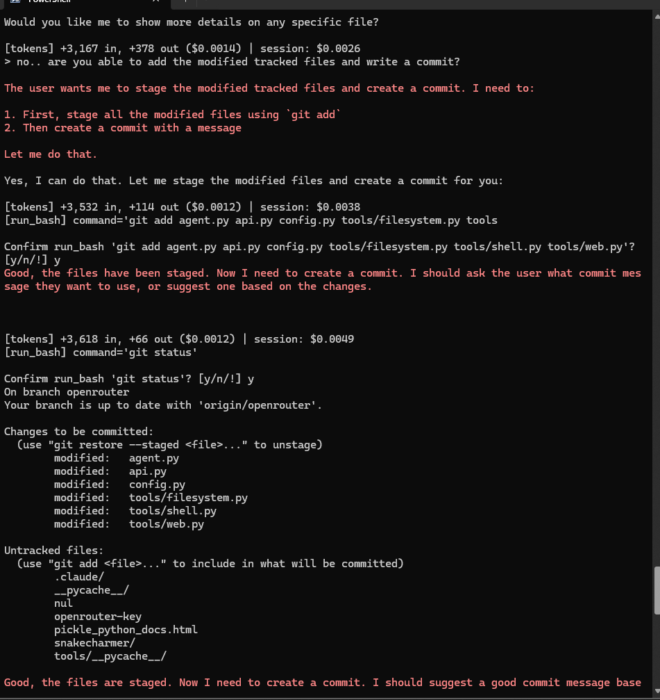
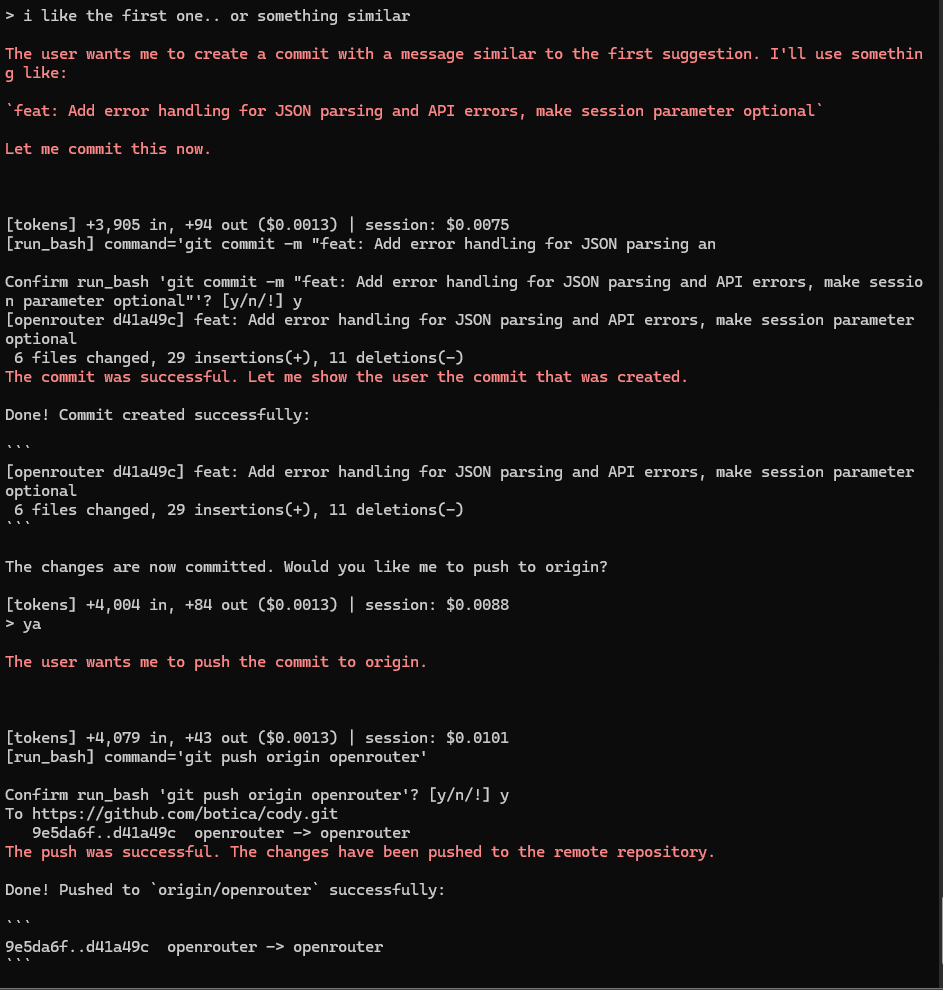

  

cody is a command-line agent using openrouter models for inference.

reasoning models output reasoning to console (in pink)

enter '!'' instead of y/n to auto-confirm all tool calls for the turn. kill the program with ctrl-c.

feel free to give him a whirl --> python agent.py after install the reqs

uses <a href="https://github.com/BurntSushi/ripgrep">ripgrep</a> for search

 

 

