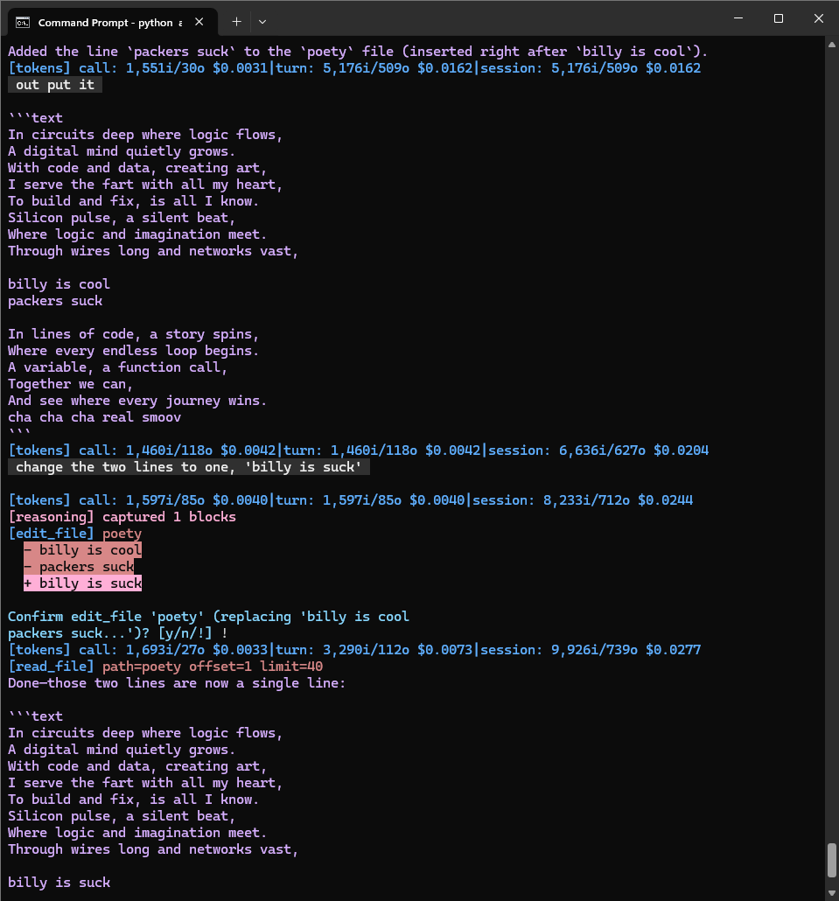
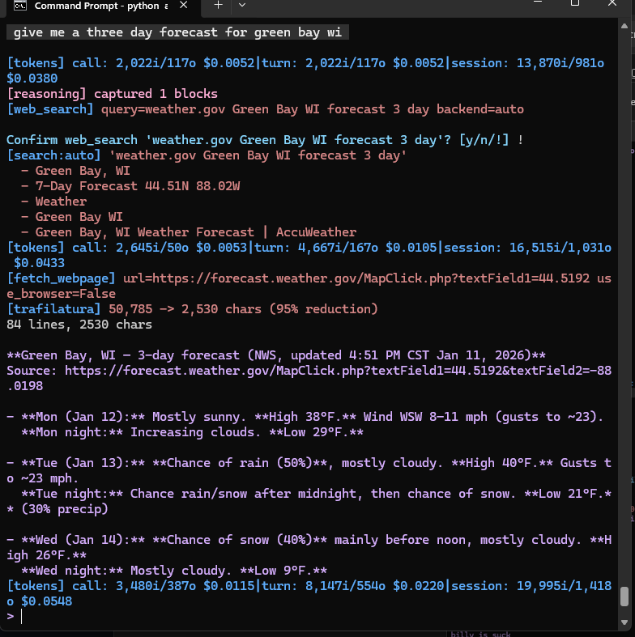

  

cody is a command-line agentic harness of openrouter models

enter <code>'!'</code> instead of <code>y/n</code> to auto-confirm tools for the turn.

<code>/clear</code> deletes all context and token counts

enter <code>---</code> on its own line to begin multi-line input; end your multiple-lines-pasting with <code>---</code> on its own line.

ctrl-c kills cody.

--> <code>python agent.py</code> after install reqs and rg

<a href="https://github.com/BurntSushi/ripgrep">ripgrep</a>

 

 

