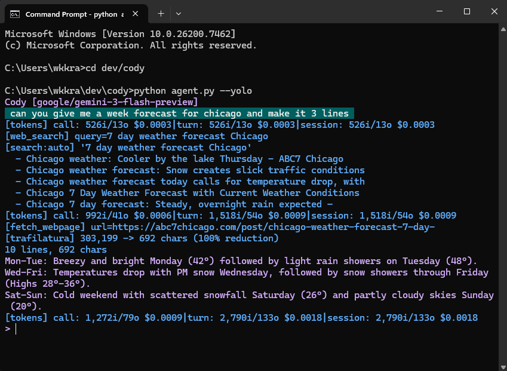
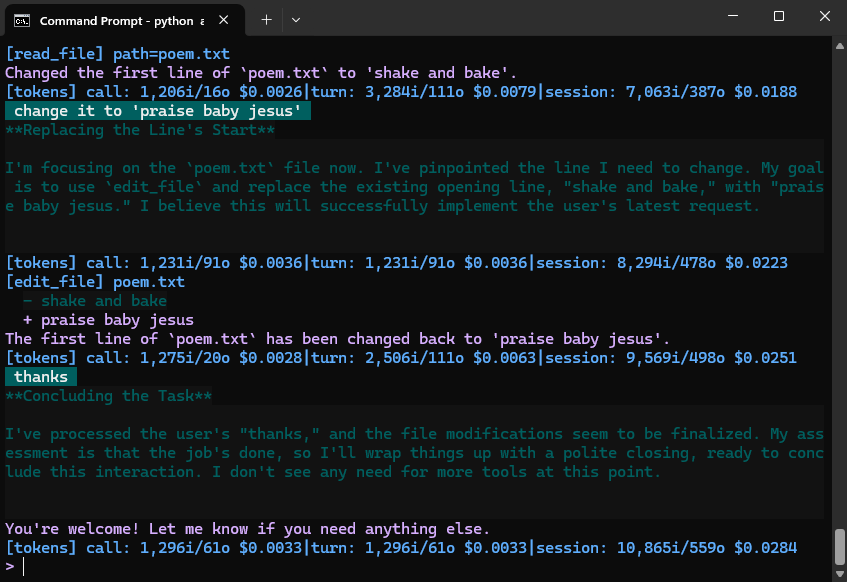

  

cody is a command-line agentic harness for openrouter models

cody has these tools: read_file, list_directory, write_file, edit_file, delete_file, search, fetch_webpage, web_search, and run_bash.

run as <code>python agent.py</code> after installing the dependencies in requirements.txt as well as <a href="https://github.com/BurntSushi/ripgrep">ripgrep</a> (for search)

enter <code>'!'</code> instead of <code>y/n</code> to auto-confirm tools for the turn.

run with <code>--yolo</code> flag to auto confirm for session

<code>/clear</code> deletes all context and token counts

if you need to paste multiple lines, enter <code>---</code> on its own line to begin multi-line input; end with  <code>---</code> on its own line.

ctrl-c kills the program.

edit config.toml to switch models, toggle reasoning output, etc.

without reasoning:

 
reasoning:

