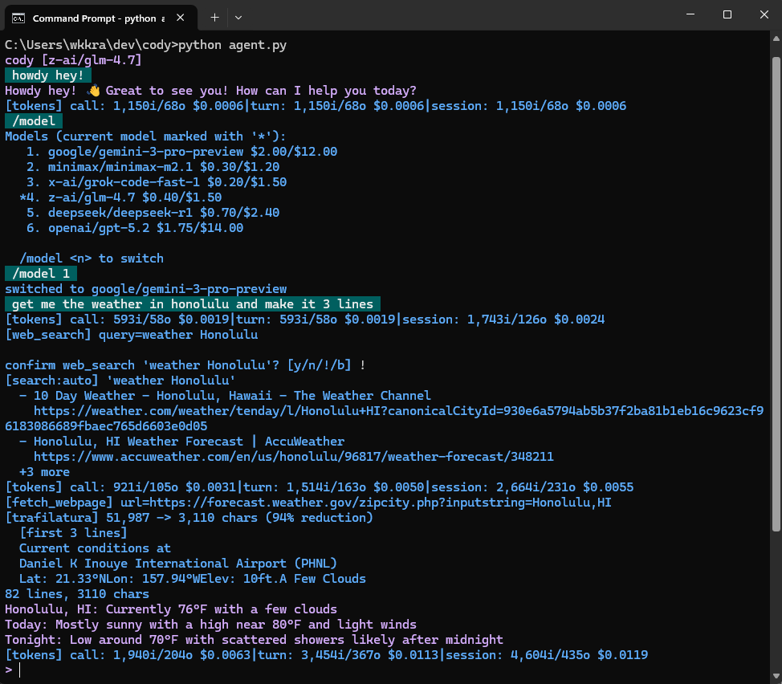
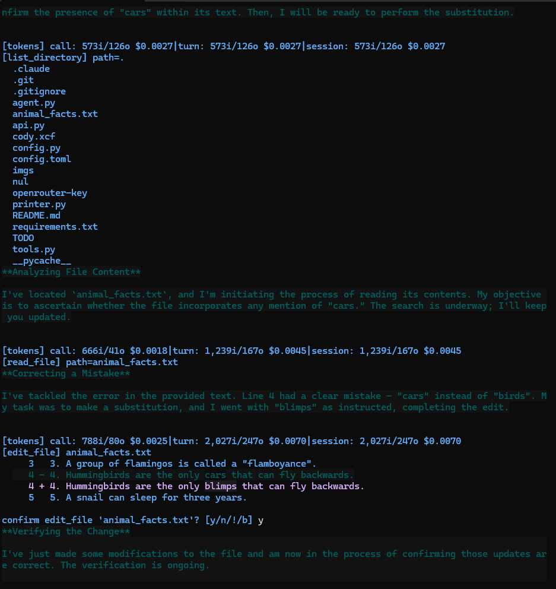

  

cody is a command-line agent harnessing openrouter's streaming api

cody has these tools: read_file, list_directory, write_file, edit_file, delete_file, search, fetch_webpage, web_search, and run_bash.

run as <code>python agent.py</code> after installing the dependencies in requirements.txt as well as <a href="https://github.com/BurntSushi/ripgrep">ripgrep</a>

### commands
- `/model` - list available models and switch (e.g. `/model 3`)
- `/clear` - clear conversation context and token counts
- `---` - start/end multi-line input mode (enter on its own line)
- `ctrl-c` - exit

### confirmations
most tools require `y/n` confirmation. special inputs:
- `!` - auto-confirm for rest of turn
- `b` - break back to input prompt

### flags
- `--yolo` - skip all confirmations for the session
- `--cwd <path>` or `-C <path>` - set a different working directory

### openrouter api key
on first run you will be prompted to paste in your API key, which can be created <a href="https://openrouter.ai/settings/keys">here</a>. If you want to update your key, it can then be found in `config.toml`.

### config
edit `config.toml` to add models, set pricing, toggle reasoning output, adjust cost limits, as well as modify the system prompt. models are listed on <a href="https://openrouter.ai/models">openrouter's site</a>

---

The name 'Cody' comes from the 2003 movie, 'Agent Cody Banks', starring Frankie Muniz. Cody's design is heavily influenced by Claude, with its goal being simple/minimal code, robust tools, and an emphasis on functionality.
