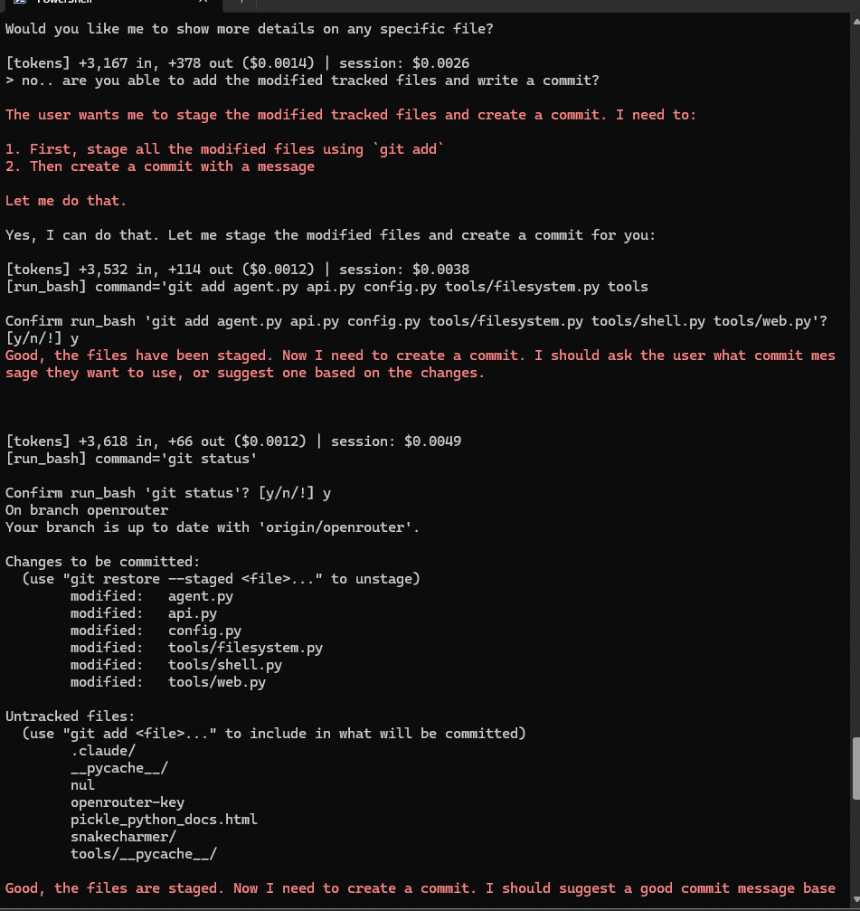
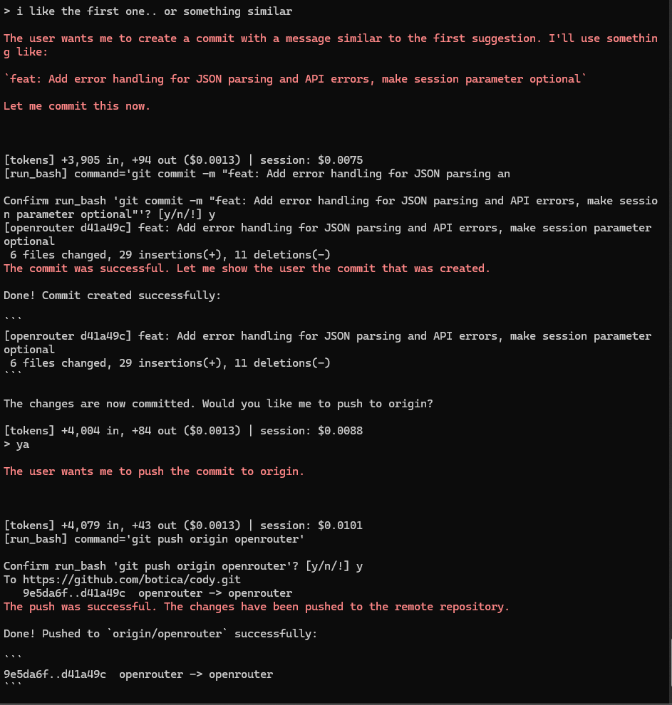

  

cody is a command-line agent using openrouter models for inference.

reasoning models output reasoning to console (in pink)

enter '!' instead of y/n to auto-confirm tool calls for the turn.

<code>/clear</code> clears the current conversation context (and resets token/cost counters).

use """ or ''' for multi-line input. close with delimiter on its own line or at end of a line.

ctrl-c kills cody to death.

--> python agent.py

uses <a href="https://github.com/BurntSushi/ripgrep">ripgrep</a> for search

 

 

